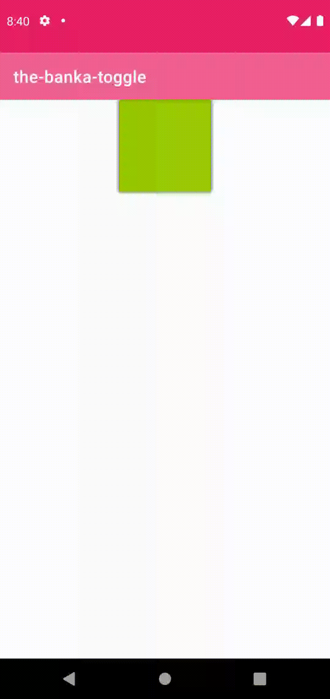
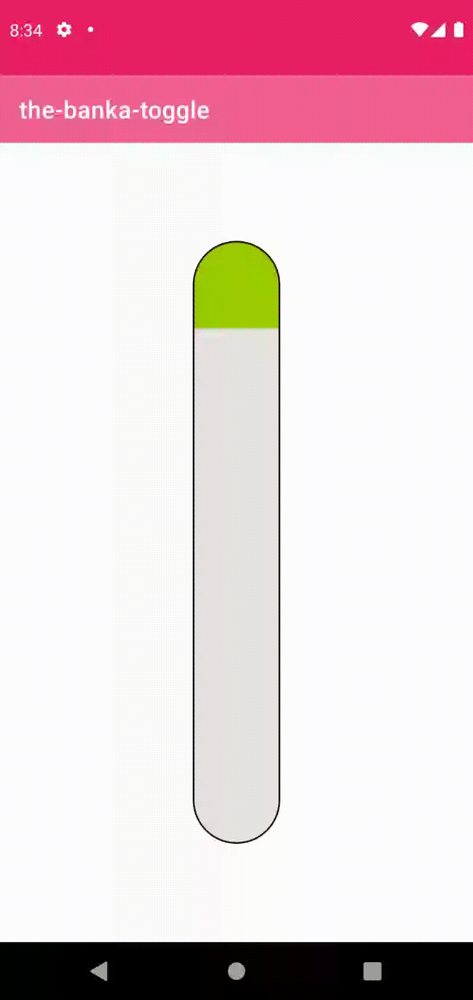
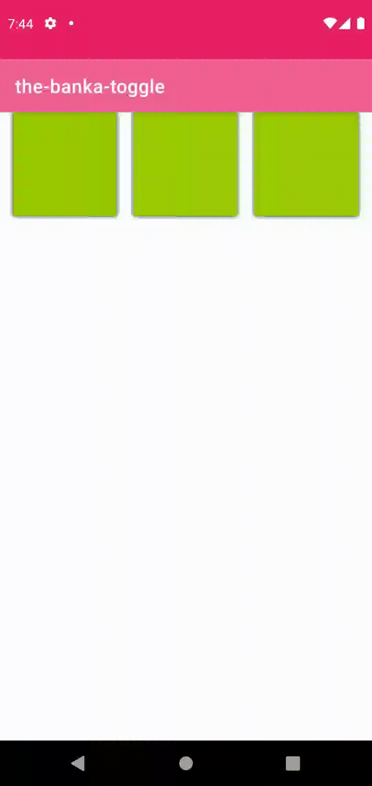

# The బంక | banka | バンカ Toggle on Android

This Android implementation is inspired by the iOS version of [@CodeSlice](https://twitter.com/CodeSlice)'s [Ridiculously Large, Sticky, and Stretchy Toggle](https://twitter.com/CodeSlice/status/1337108594718859271)

## Current బంక status

| Basic | Capsule [(See impl PR)](https://github.com/kinnerapriyap/the-banka-toggle/pull/1) | Three in one [(See impl PR)](https://github.com/kinnerapriyap/the-banka-toggle/pull/2) |
| -- | -- | -- |
|  |  | 
